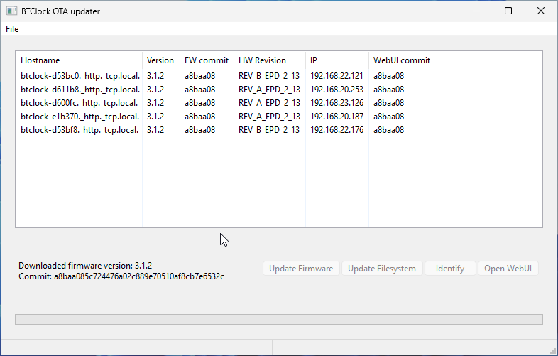
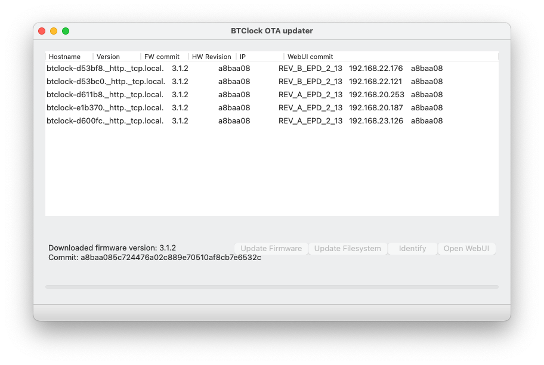

# BTClock OTA Flasher interface




## Instructions
- Make sure you have Python (tested with Python 3.12)
- Run `pip3 install -r requirements.txt`
- Run `python3 app.py`
- Profit

## Bundle with PyInstaller

### macOS

```shell
pyinstaller --hidden-import zeroconf._utils.ipaddress --hidden-import zeroconf._handlers.answers  -n BTClockOTA -i update-icon.icns --windowed app.py
````

### Windows

````
pyinstaller.exe  BTClockOTA.spec 
````

### Linux 

````
`pyinstaller --hidden-import zeroconf._utils.ipaddress --hidden-import zeroconf._handlers.answers  -n BTClockOTA --windowed app.py`
````